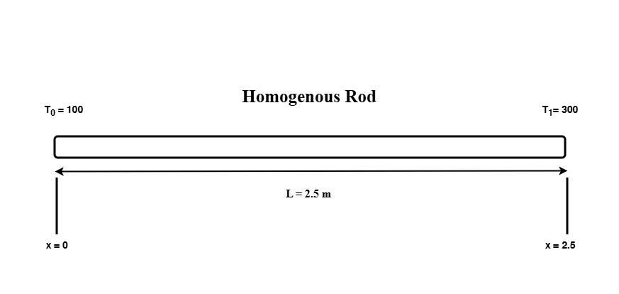
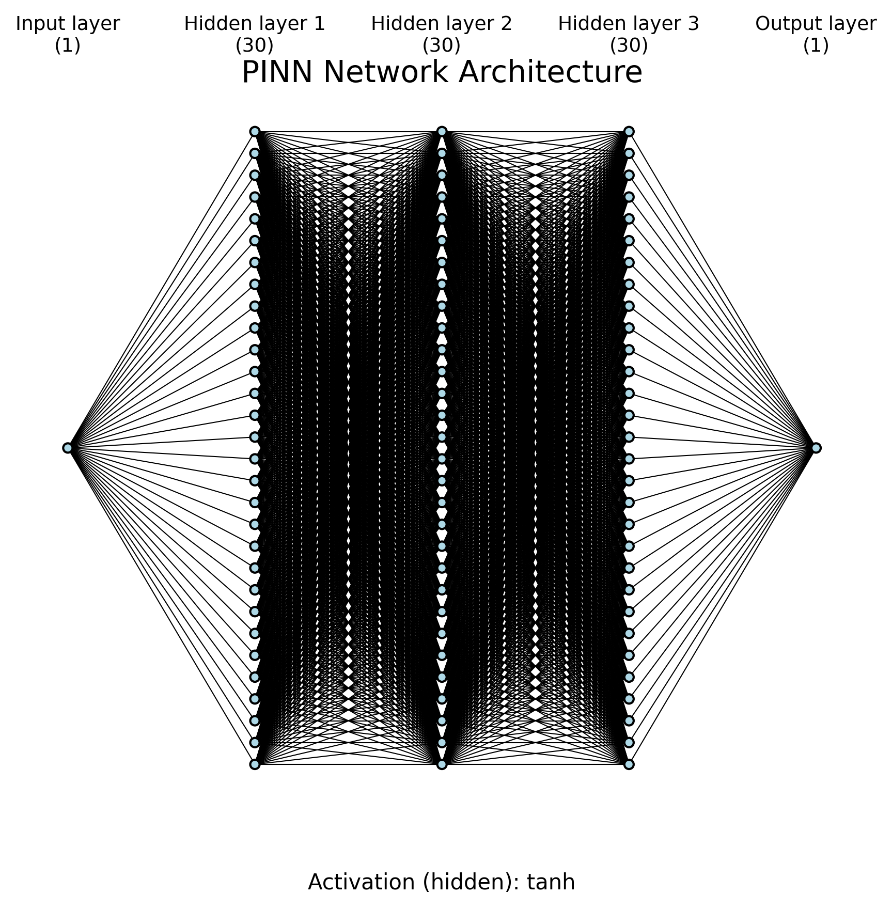
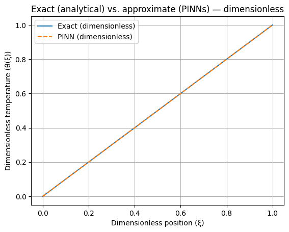
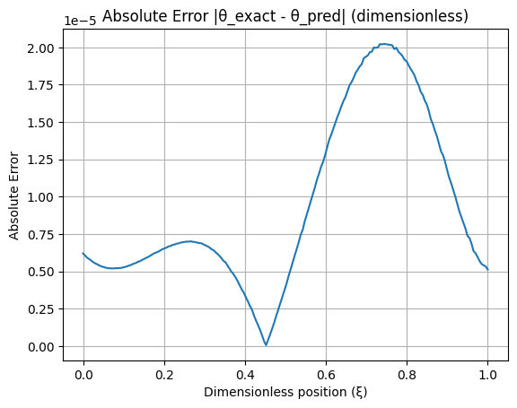
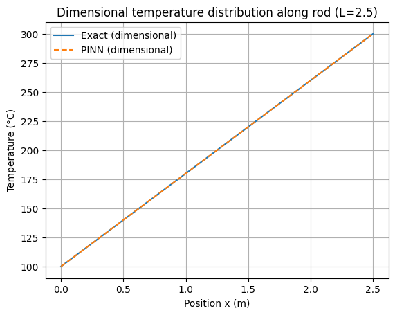
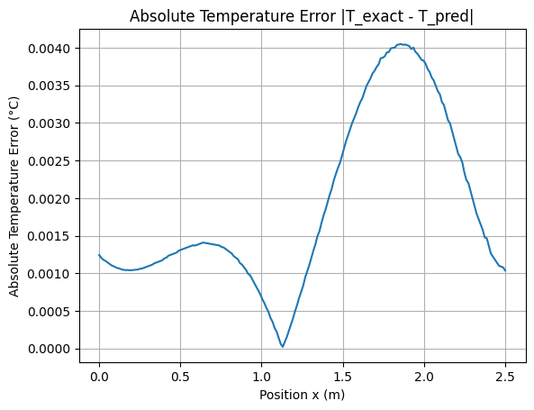

# 📘 **Project 1. Physics-Informed Neural Network (PINNs) Solution of         One-Dimensional Steady-State Heat Conduction in a homogeneous rod**

This repository implements a **Physics-Informed Neural Network (PINN)** to solve the classical **1D steady-state heat conduction equation**.
It includes:

* Full PINN implementation
* Collocation point sampling
* Automatic differentiation
* Results and comparison with analytical solution
* Error plots (nondimensional & dimensional)
* Automatically generated **network architecture diagram**
* A clean project structure suitable for research & academic work

## 🔥 **Problem Overview**

We consider a homogeneous rod of length:


``` python
L = 2.5 m
```

with fixed temperatures:

``` pyton
T(0) = 100°C
T(L) = 300°C
```

### **Governing Equation**

Fourier’s law and the 1D energy balance yield:

$$
\frac{d^2 T}{dx^2} = 0
$$

### **Nondimensionalization**

$$
\xi = \frac{x}{L}, \qquad
\theta = \frac{T - T_0}{T_1 - T_0}
$$

The nondimensional governing equation becomes:

$$
\frac{d^2 \theta}{d\xi^2} = 0
$$

with boundary conditions:

$$
\theta(0)=0, \qquad \theta(1)=1
$$

The analytical solution:

$$
\theta(\xi) = \xi
$$

$$
T(x) = T_0 + (T_1 - T_0)\theta(\xi)
$$

## 🧠 **PINN Method Summary**

A fully-connected neural network learns the function $\theta(\xi)$ by minimizing:

* PDE residual loss
* Boundary condition loss

using **automatic differentiation** (PyTorch).

Optimization uses:

* **Adam** (initial training)
* **L-BFGS** (refinement)

No mesh or labeled data is needed.

## 📂 **Project Structure**

```bash
Project1-root/
│
├── README.md
├── LICENSE
├── requirements.txt
│
├── docs/
│   └── report_project1_heat1D.pdf
│
├── src/
│   ├── main_project1.py
│   │
│   ├── models/
│   │   └── fully_connected_pinn.py
│   │
│   ├── physics/
│   │   ├── heat1d_pde.py
│   │   └── boundary_conditions.py
│   │
│   ├── training/
│   │   └── trainer.py
│   │
│   ├── utils/
│   │   ├── data_sampling.py
│   │   ├── plotting.py
│   │   ├── config_loader.py
│   │   ├── plot_architecture.py
│   │   └── __init__.py
│   │
│   └── configs/
│       └── config.yaml
│
├── experiments/
│   ├── results/
│   │   ├── theta_pred.npy
│   │   ├── theta_exact.npy
│   │   ├── T_pred.npy
│   │   └── T_exact.npy
│   │
│   ├── figures/
│   │   ├── theta_comparison_dimensionless.png
│   │   ├── theta_absolute_error_dimensionless.png
│   │   ├── temperature_distribution_dimensional.png
│   │   ├── temperature_absolute_error_dimensional.png
│   │   └── network_architecture.png
│   │
│   └── saved_models/
│       └── heat1d_pinn.pt
│
└── .gitignore

```

## 🛠️ **Requirements**

Install dependencies:

### **Using pip**

```bash
pip install -r requirements.txt
```

### requirements.txt should contain

```bash
torch
numpy
matplotlib
pyyaml
tqdm
scipy
```

## ▶️ **How to Run**

From project root:

```bash
cd src
python main_project1.py
```

Modify configuration inside:

```bash
src/configs/config.yaml
```

## 📊 **Results**

All figures are located in:

```bash
experiments/figures/
```

## **1. Neural Network Architecture**



This schematic is auto-generated from `config.yaml` and shows the number of neurons in each layer plus full connectivity.

## **2. Nondimensional Temperature: PINN vs Analytical**



The PINN solution matches the analytical solution almost perfectly.
The curves overlap, confirming correct learning of the PDE physics.

## **3. Nondimensional Absolute Error**



The error stays below (10^{-5}), demonstrating excellent accuracy.

## **4. Dimensional Temperature Distribution**



The dimensional reconstruction again yields a perfect match to the analytical linear temperature field.

## **5. Absolute Dimensional Error**



Errors stay below (5 \times 10^{-3} , ^\circ\mathrm{C}) across the domain.

## ✔ **Conclusion**

The PINN successfully reproduces the analytical solution for 1D steady-state heat conduction  in a homogeneous rod with extremely small error.
This validates PINNs as:

* Mesh-free
* Physics-driven
* Highly accurate
* Suitable for forward and inverse problems

This project serves as a foundation for future PINN work involving:

* Internal heat generation
* Nonlinear thermal conductivity
* 2D/3D heat transfer
* Transient conduction
* Coupled convection–diffusion equations
* Inverse heat conduction problems

## 📚 **References**

```md
[1] M. Raissi, P. Perdikaris, and G.E. Karniadakis,
    "Physics-informed neural networks," JCP, 2019.

[2] G.E. Karniadakis et al.,
    "Physics-informed machine learning," Nature Reviews Physics, 2021.

[3] F.P. Incropera et al.,
    "Fundamentals of Heat and Mass Transfer," Wiley, 2011.
```

## 🤝 **Collaboration**

If you'd like to collaborate on:

* PINNs for advanced heat transfer
* Scientific machine learning
* CFD + ML hybrid methods
* Expanded PINN project series

Feel free to reach out!

## 📬 Contact

Feel free to reach out through any of the platforms below:

[](mailto:arya.abdollahi.t@gmail.com)
[](https://www.linkedin.com/in/arya-abdollahi/)
[](https://t.me/the_AryaAB)
